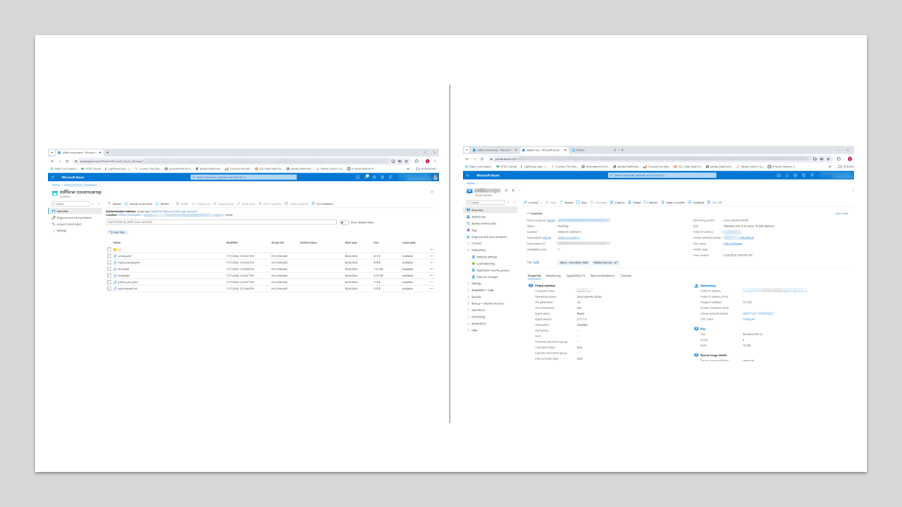

## Section 2: Welcome to the Expirement Tracking & Model Registry :smiley:

- Activate virtual environment source. e.g. for linux system run:
  ./mlvenv/bin/activate
- Navigate into expirement tracking directory. for linux system run:
  cd ./02-expirement_tracking_model_registry
- Run the first script:
  python preprocessor.py

----------------------------------------------------------------------------------------------------------------------------------------------------------------------------
### To run MLflow remotely on Azure Cloud:
- Set remote-tracking server IP address to Azure Virual Machine Server. e.g. remote-server-ip-adress= "http://XX.XX.XXX.XXX:5000"
- To store artifacts in Azure Blob Storage, specify a URI of the form wasbs://<container>@<storage-account>.blob.core.windows.net/<path>. MLflow expects that your Azure Storage access credentials are located in the AZURE_STORAGE_CONNECTION_STRING and AZURE_STORAGE_ACCESS_KEY environment variables
- On seperate terminal activate the mlvenv enviroment again
- Pass the enviroemntal variable stored in setenv.sh file in the main directory, by running the command for linux: source ../setenv.sh
- Run the mlflow server. run the following command:
    mlflow server --backend-store-uri sqlite:///mlflow.db --default-artifact-root wasbs://container-name@storage-account.blob.core.windows.net/mlartifacts -h 0.0.0.0 -p 5000
----------------------------------------------------------------------------------------------------------------------------------------------------------------------------
### To run MLflow Locally:
- Run the command: mlflow server --backend-store-uri sqlite:///mlflow.db --default-artifact-root ./mlruns --host 0.0.0.0 --port 5000
----------------------------------------------------------------------------------------------------------------------------------------------------------------------------
- Go back to the main terminal and run the folowing scripts: locate the directory again at Dir: expirement_tracking_model_registry/
    python ./hyper-opt.py
    python ./register_model.py

- If you run on Azure Remote Storage Account. check you Azure Blob storage location and you will find the artifacts have been stored and you can share your expirements and results with your team using the remote-tracking server
- Check the images below to verify my run remotely on Azure Cloud!

