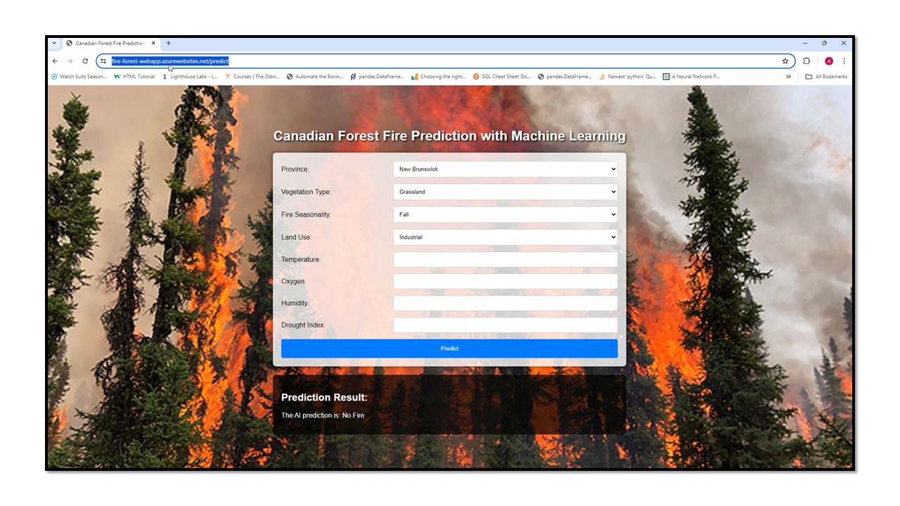
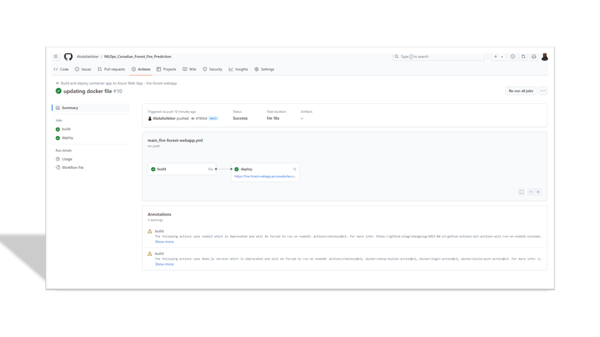

## Section 4: Welcome to the Model Deployment :smiley:

The model has been deployed on Azure Wepp service utilizing the CICD pipline with github actions 

To run the model on Azure Cloud:
- Provision Azure Web App with container resoure
- Create Container Registry 
- Docker set up in local and push container registry
- Configure the GitHub Deployment center

- locate terminal to the main Dir: cd ./MLOps_Canadian_Forest_Fire_Prediction
- Check the Dockerfile to ensure what is needed for deployment:
    app.py
    The model: artifacts/models/best_model.joblib
    static folder
    template folder
- Utilize the CI/CD pipeline with github actions

To run the model locally:
- open a new terminal and activate virtul enviorment
- locate terminal directory to: dc ./model_deployment
- run fast api server by running: python main.py
- verify the server is working by running: python score.py and recieves score 

