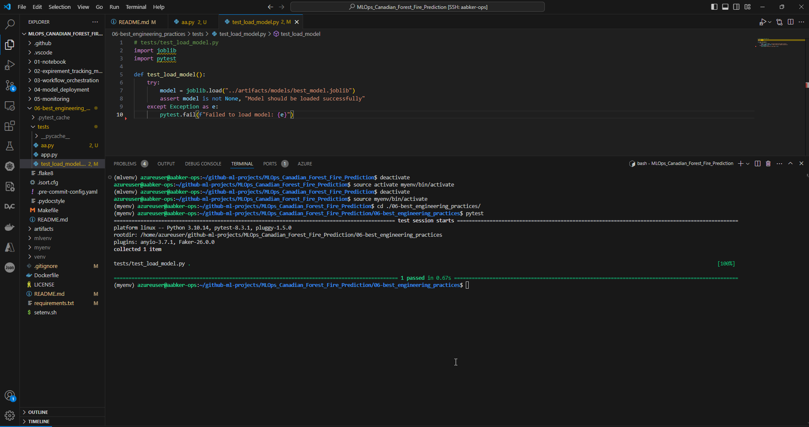

## Section 6: Welcome to the Best Engineering Practices :smiley:

- CI/CD Pipeline: runs every time you push new changes into main branch
- Run unit test & Run Integration test:
    - cd 06-best_engineering_practices/tests/
    - Run command on terminal: pytest
- Run Black: navigate into main dir: run for all code: black .
- Run isort: isort .
- Run pre-commit hooks (manually): 
    - Navigate into: cd ./06-best_engineering_practices
    - Run command on terminal: pre-commit run --all-files 