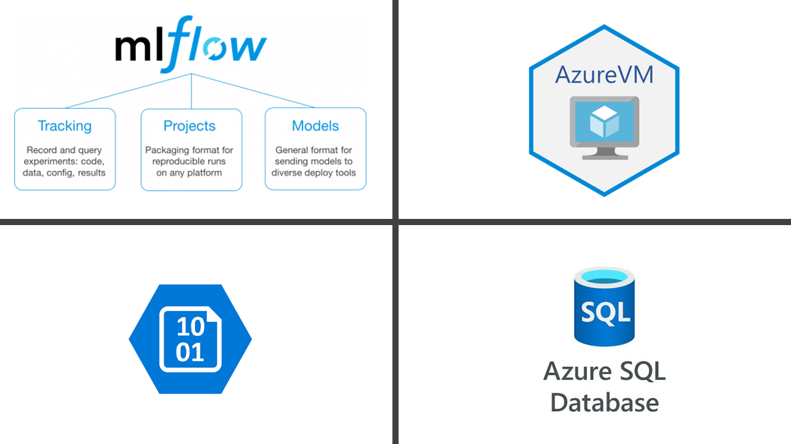

## Section 2: Welcome to the Expirement Tracking & Model Registry :smiley:

- Activate environment source. e.g. for linux system run: ./mlvenv/bin/activate
- Enter expirement tracking directory. for linux system run:  cd ./expirement_tracking_model_registry
- Run python preprocessor.py
- Set remote-tracking server IP address to Azure Virual Machine Server. e.g. remote-server-ip-adress= "http://XX.XX.XXX.197:5000"
- On seperate terminal activate the mlvenv enviroment again
- To store artifacts in Azure Blob Storage, specify a URI of the form wasbs://<container>@<storage-account>.blob.core.windows.net/<path>. MLflow expects that your Azure Storage access credentials are located in the AZURE_STORAGE_CONNECTION_STRING and AZURE_STORAGE_ACCESS_KEY environment variables
- Pass the enviroemntal variable stored in setenv.sh file in the main directory, by running the command for linux: source ../setenv.sh
- Run the mlflow server. run the following command: mlflow server --backend-store-uri sqlite:///mlflow.db --default-artifact-root wasbs://container-name@storage-account.blob.core.windows.net/mlartifacts -h 0.0.0.0 -p 5000
- Go back to the main terminal and run the folowing scripts: locate the directory again at Dir: expirement_tracking_model_registry/
    python ./hyper-opt.py
    python ./register_model.py
- Check you Azure Blob storage location and you will find the artifacts have been stored and you can share your expirements and results with your team using the remote-tracking server 

