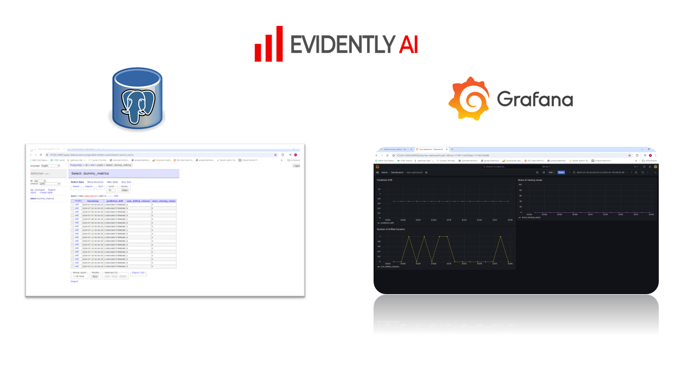

Welcome to the Workflow Orchestration Section :wave:

- locate your terminal directory into Dir: cd ./model_monitoring
- Activate the virtual enviroment in one terminal and run: docker-compose up -build
- Make sure the 3 services are up and running:
    grafana: localhost:3000
    Adminer DB: localhost:8080
    Postgress db: running in the backend
- Make sure to stay in the correct directory Dir: cd ./model_monitoring and Run: python metrics_calculation.py
- After the script starts sending data t the db, verify the data has been store in Posgres DB and visualized in Grafana dashboard

