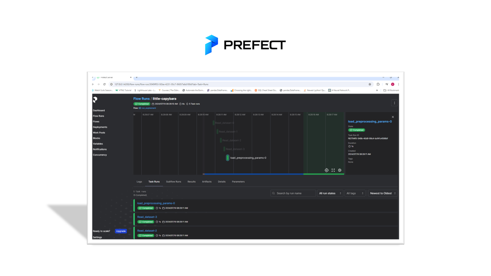

## Section 3: Welcome to the Workflow Orchestration :smiley:

- locate your terminal directory into Dir: cd ./workflow_orchestration
- Activate the virtual enviroment in one terminal and run: prefect server start 
- Open a new seperate terminal and orchestrate.py script against the server started in the previous step. 
- Make sure to stay in the correct directory Dir: cd ./workflow_orchestration and Run: python orchestrate.py
- Open a third seperate terminal (Dir: cd ./workflow_orchestration) and activate mlflow server locally and run the following command:
    mlflow server --backend-store-uri sqlite:///mlflow.db --default-artifact-root ./mlruns --host 0.0.0.0 --port 5000

